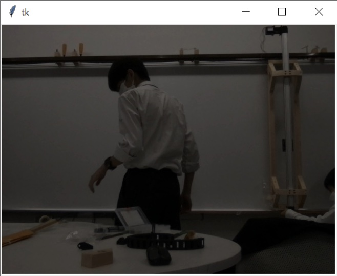

# RTミドルウエアを用いた自動ホワイトボード消しの開発

## 2021/12/16 第5版発行

亀井 達朗, 林 蒼二朗, 檜垣 葵, 福田 啓太, 和田 崇志, 中村 嶺介, 村上 和豊, 良知 航星（芝浦工業大学附属中学校）
山﨑 路真（芝浦工業大学附属高等学校）
山岡 佳代, 横山 浩司（芝浦工業大学附属中学高等学校）
 佐々木 毅（芝浦工業大学）

---

# 目次

1. **本コンポーネントの概要**

   1.1. 開発の背景

   1.2. 開発の環境
   1.3. システムの概要

2. **ソフトウェア**

   2.1. start

   2.2. camera

   2.3. slect

   2.4. move

3. **ハードウェア**

   3.1. 本体部

   3.2. 回路部

   3.3. 設計部

   3.4. 回路図

4. **コンポーネントの使い方**

   4.1. コンポーネントの起動

   4.2. ポートの接続

   4.3. 装置の稼働

---

# 1.本コンポーネントの概要

## 1. 開発の経緯

教育現場の多くでホワイトボードが使用されている。しかし、ホワイトボードに書かれた文字を消す作業に、時間を要することが多く、手が汚れることもある。そこで、RTミドルウエアを使ってホワイトボードに書かれた文字を自動で消す装置の開発を行った。これは、学校生活などの日常の不便の解決する装置として制作した。実際に教育現場で活用することで、RTミドルウエアに関心をもってもらうきっかけになることを願う。

## 2. 開発環境

本コンポーネット群の開発環境を以下に示す。

| OS             | Windows10                             |
| -------------- | ------------------------------------- |
| RTミドルウエア | OpenRTM-aist-1.2.2-RELEASE (python版) |
| 開発環境       | Visual Studio Code1.62.2              |
| Python         | Python3.8.5                           |
| 必要モジュール | Pyautogui, OpenCV, Pillow, os         |

自動ホワイトボードのイメージ

## 3. システムの概要

このシステムは、ユーザーの指定した範囲もしくは、全範囲(つまり全消し。今後実装予定)をレールや枠組みに沿って本体が移動し自動でホワイトボードに書かれたものを消すものである。

そして、制御部分にはRTミドルウェアを用いており、cameraコンポーネントを用いて取得したホワイトボードの動画(画像)をselectコンポーネントで消す範囲を選択し、moveコンポーネントで実際に動かす。というものである。

---

# 2.ソフトウェア

## 1. start

startは任意のタイミングで動作を開始させるためにキーボード入力を待つコンポーネントである。

入力を受け取ると、OutPortから信号を出す。カメラを置く位置が遠く、ホワイトボード以外の部分が写真に含まれてしまうと正確に消したい場所を取得できないため、ホワイトボードの位置をドラッグ操作にて取得し、トリミングする機能も持たせた。

* **InPort**

| **名称** | **データ型** | **説明**                                           |
| -------- | ------------ | -------------------------------------------------- |
| State    | TimedBoolean | stopからの信号を受け取る。                         |
| Back     | TimedBoolean | cameraの処理を中断した時に送られる信号を受け取る。 |

* **OutPort**

| **名称** | **データ型** | **説明**                                                     |
| -------- | ------------ | ------------------------------------------------------------ |
| State    | TimedBoolean | Cameraへ動作を開始する許可を出す。                           |
| Path     | TimedString  | トリミングするための写真上の座標を渡す。 一度座標をString型にまとめ、渡した後分解することでポートを一つに抑えた。 |

* **Configuration変数**

なし

## 2. camera

OpenCVを用いて写真を撮影するためのコンポーネントである。

今回は取得した写真を一度ディレクトリ下に保存し、パスをselectに渡すことで写真の受け渡しを行う。また、撮り直しの機能も持たせた。

* **InPort**

| **名称** | **データ型** | **説明**                                     |
| -------- | ------------ | -------------------------------------------- |
| State    | TimedBoolean | 動作開始の許可を受け取る。                   |
| Path     | TimedString  | トリミングするための写真上の座標を受け取る。 |

* **OutPort**

| **名称** | **データ型** | **説明**                                |
| -------- | ------------ | --------------------------------------- |
| Path     | TimedString  | selectへパスを渡す。                    |
| Back     | TimedBoolean | 撮り直しを行う際に、startへ信号を行う。 |

* **Configuration変数**

なし

## 3. select

消す範囲を指定するためのユーザインタフェースのコンポーネントである。

画像データ取得し、その画像データを背景としたウィンドウを作成する。この画像上をマウスで範囲指定すると、その座標を出力する。

* **InPort**

| **名称** | **データ型** | **説明**                       |
| -------- | ------------ | ------------------------------ |
| Path     | TimedString  | 写真のファイルパスを受け取る。 |

* **OutPort**

| **名称** | **データ型** | **説明**                                       |
| -------- | ------------ | ---------------------------------------------- |
| trans    | TimedLong    | moveのモータ制御に使用する位置座標を出力する。 |

* **Configuration変数**

「r_selection」,「up_right」,「up_left」,「down_right」,「down_left」の５つから成るradio型。消す位置をある程度テンプレート化し、毎回範囲選択しなくてもすぐに消し始められるようにした。例えば、「up_left」を選択した場合には左上を消し、 「r_selection」を選択した場合は詳細の範囲を選択する。 

## 4. move

受け取った位置座標をもとにモータ制御を行い、ハードを動かす。

* **InPort**

| **名称** | **データ型** | **説明**                             |
| -------- | ------------ | ------------------------------------ |
| trans    | TimedLong    | ユーザが指定した位置座標を受け取る。 |

* **OutPort**

| **名称** | **データ型** | **説明**           |
| -------- | ------------ | ------------------ |
| State    | TimedBoolean | stopへ信号を送る。 |

* **Configuration変数**
  ホワイトボードの縦と横の長さを指定する「W_width」, 「W_height」と、モータが一回転で何cm機体を動かせるかの「M_power_width」, 「M_power_height」をint型で指定できるようにした。

---

# 3.ハードウェア

3.1と3.2に今回の制作に使用した部品にまとめた。

## 1. 本体部

| **品目**                              | **個数** | **備考**                               |
| ------------------------------------- | -------- | -------------------------------------- |
| 取付接着金具・アクセサリ ステンレス製 | 3        | 機械の固定のために使用                 |
| 赤松 角材                             | 6        | 機械本体の骨組みに使用 40*30*1985      |
| ステンレスワイヤーロープ              | 1        | 機械の固定に使用 1.5mm                 |
| 本体の移動用のキャスタ                | 1        | 機械本体の移動に使用                   |
| アルミローラーレール                  | 5        | 機械本体の移動レール 1m                |
| 工作台用クランプ                      | 4        | フレーム固定用クランプ                 |
| タイミングベルト                      | 1        | 駆動用のベルト 10m                     |
| コントロールボックス                  | 1        | 回路収納用の箱　110*65*150             |
| ケーブルキャリア                      | 7        | 配線をまとめるため使用                 |
| ウォーターポンプ                      | 1        | 水のポンプ                             |
| アクチュエータ                        | 1        | Y軸のレール兼駆動                      |
| 材木 天然木                           | 5        | レールのパーツ 20*30*1200              |
| シリコンチューブ                      | 1        | 水の供給チューブ                       |
| 木ネジ                                | 1        | 木ネジ                                 |
| アイドラプーリー　アルミニウム合金製  | 1        | タイミングベルトの指示                 |
| 木材                                  | 2        | アクチュエータ部分の支え               |
| アルミ板                              | 1        | 操作盤やタイミングベルト部分の裏付け   |
| マイクロファイバーぞうきん            | ３       | 消す部分に使用                         |
| 縫製用マジックテープ１００ミリ巾Ａ面  | ２       | 雑巾と本体の接着に使用　黒（１０ｃｍ） |

## 2. 回路部

| **品目**             | **個数** | **備考**                           |
| -------------------- | -------- | ---------------------------------- |
| 回路用ケーブル       | 1        | 回路用のコード                     |
| 回路用被膜付き銅線   | 1        | 配線のために使用                   |
| ユニバーサル基盤     | 1        | 配線のために使用                   |
| 伸縮チューブ         | 1        | 配線のために使用                   |
| コネクタ（配線用）   | 1        | 配線のために使用                   |
| コネクタ（基板用）   | 1        | 基盤と配線をつなぐため使用         |
| コネクタ（高電圧用） | 1        | 高電圧の電流を流す部分の配線に使用 |
| ターミナルコネクタ   | 1        | 配線のために使用                   |
| ヤニ入りはんだ       | 1        | 配線のために使用                   |
| ステッピングモータ   | 3        | 白坂を消すために使用               |
| Raspberry Pi 4       | 1        | プログラムを入れるため使用         |
| コネクタ             | 1        | Raspberry Pi 4 への配線            |
| スペーサーボルト     | 1        | 基盤固定                           |
| acアダプタ           | 1        | モータへの電気供給                 |
| 直流電流変換器       | 1        | ポンプへの電気供給                 |

## 3. 設計図

ホワイトボードの上下にレールがあり、レールに沿って枠組みがスライドする。枠組み内に設置されている本体が、ホワイトボードから垂直方向に稼働し、消す際はホワイトボード表面に本体を当て続けインクを消す。装置には強度面、加工面、価格面の点で優れている木材を主に使用し、軽量化を図った。また、木製の枠組みの使用だけではなく、マイクロファイバーの布で消すことで、ホワイトボードに傷をつけることなく、消したり設置したりできる。デザイン面において、あまり複雑な形状にせず、加工しやすい形にした。強度面において、可能な限りホワイトボードと固定する角材の本数を多くして、重量が偏らないようにした。

## 4. 回路図

Moterdriverが文字道理モータドライバで、ラズパイでPWMを出力し、モータを制御する。SteppingMoterはモータドライバで制御する。他の部品との接触による不具合を防ぐため、ヒューズ入れて安全性を高めている。電圧は２４Vを使用した。

---

# 4.コンポーネントの使い方

## 1. コンポーネントの起動

下図のように五つのコンポーネントを起動し、配置する。

## 2. ポートの接続

対応する名前のポート同士を接続する。

## 3. 装置の稼働

Activateし、コンソールの指示に従う。

* [y]を押すと写真を撮影する。

* 左図のような指示が出る。

* ホワイトボードの位置を選択する。
* トリミングされた範囲と確認ダイアログが表示される。
* cameraコンポーネントで写真を撮影すると指定した範囲の座標で写真のトリミングが行われる。
* 撮影した写真(左図)に、文字が書かれた場所を選択することで動作が開始される。コンフィギュレーションを利用する場合は、ウィンドウが立ち上がった段階で用意された５つの変数のうち１つを選択する。

---

---

以上。
